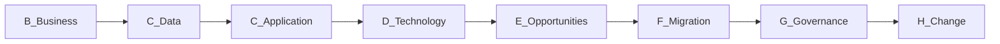
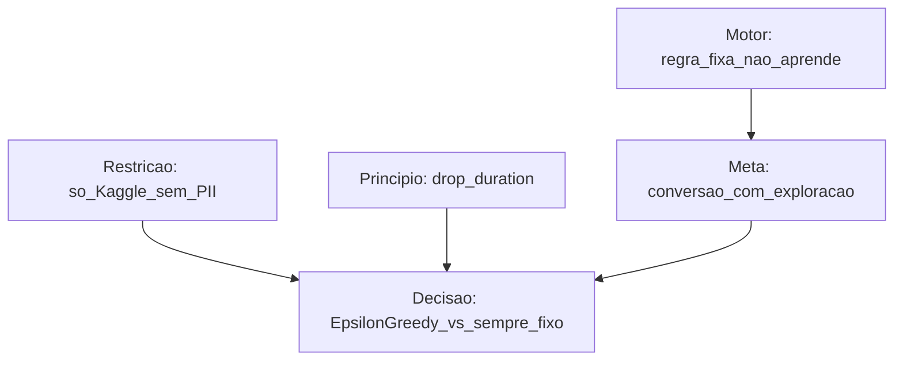
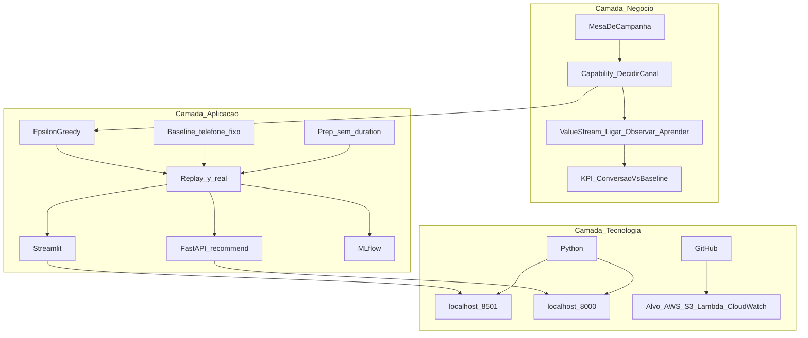
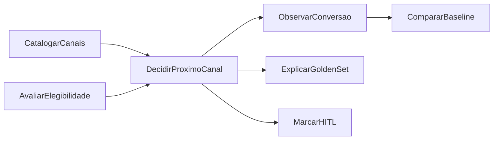
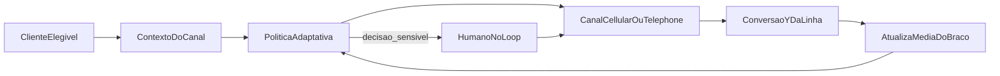
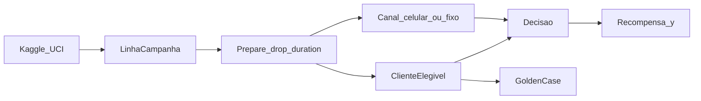
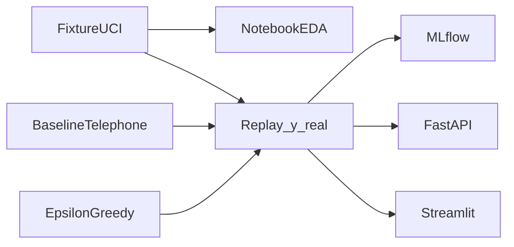
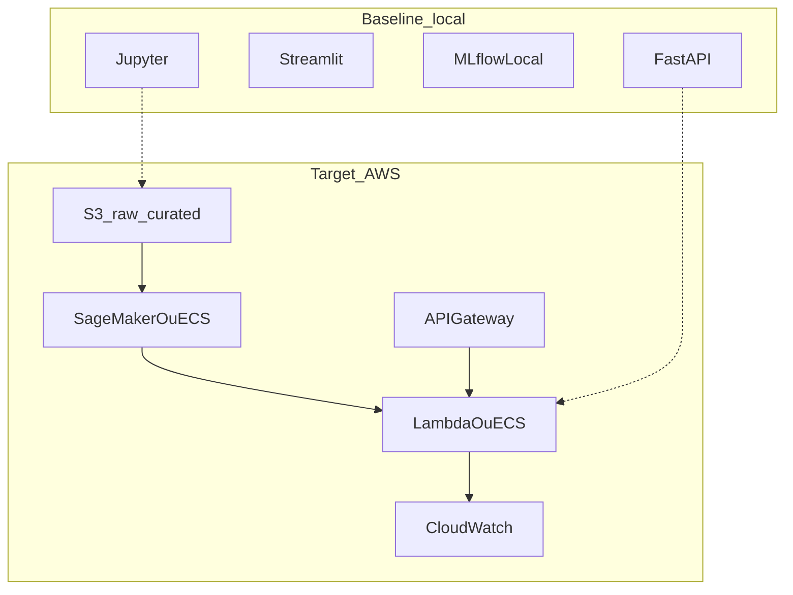

# Datathon 7MLET — canal de contato para depósito a prazo

## Estrutura local

```
datathon-7mlet/
├── README.md
├── Makefile                    # make test | demo | ui | api
├── src/                        # dados, políticas, replay, API
├── demo/app.py                 # tela Streamlit
├── scripts/demo.py             # taxas + Golden Set no terminal
├── notebooks/01_eda_bandit.ipynb
├── tests/                      # unit + e2e + fixture real
├── data/                       # base full (gitignored)
└── artifacts/                  # estado do replay (gitignored)
```

## Caso de uso

Uma mesa de campanha precisa escolher **como contactar** o cliente elegível para oferecer depósito a prazo: **celular (móvel)** ou **telefone fixo**.

Na base UCI a coluna se chama `contact` e os valores estão em inglês: `cellular` e `telephone`. **Não são a mesma coisa.** O dicionário oficial diz *contact communication type*: `cellular` = chamada para o **número móvel**; `telephone` = chamada para a **linha fixa**. Em pt-BR não existe a palavra “cellular”; o rótulo da interface é **Celular (móvel)** vs **Telefone fixo**. Na base full as taxas também diferem (14,7% vs 5,2%) — canais operacionais distintos, não sinônimos.

A base não é um banco digital nem um app. É o registro histórico de telemarketing de um banco português ([Moro et al., 2014](https://archive.ics.uci.edu/dataset/222/bank+marketing)), publicado no Kaggle como [henriqueyamahata/bank-marketing](https://www.kaggle.com/datasets/henriqueyamahata/bank-marketing). O `y` já aconteceu: o cliente assinou ou não. Não simulamos conversão.

| Peça | Fato |
|------|------|
| Decisão | braço `cellular` = celular móvel, ou `telephone` = telefone fixo |
| Recompensa | `y` da linha (`yes`→1, `no`→0) |
| Política antiga (baseline) | sempre `telephone` — regra única, não aprende |
| Política nova | Epsilon-Greedy, `ε = 0.1` |
| O que não é | core bancário, app, catálogo de produtos, dados brasileiros, PII |

Epsilon-Greedy neste MVP **não é contextual**: a escolha usa só as médias dos braços e `ε`. As features do cliente existem para o Golden Set e para recusar vazamento (`duration`), não para perfilar.

## Como executar

```bash
python3 -m venv .venv
source .venv/bin/activate
pip install -r requirements.txt
make test
make demo
make ui
```

Interface: `streamlit run demo/app.py`. API: `make api` → [http://localhost:8000/docs](http://localhost:8000/docs).

## Resultados (fixture, n=1200)

Recorte cronológico **linhas 11600:12800** de `bank-additional-full.csv` (arquivo em `tests/fixtures/bank_sample.csv`). `duration` entra no bruto e é dropado no prep.

Taxas empíricas da tabela (não são simuladas):

| contact (UCI) | Canal em pt-BR | conversão | n | conversões |
|---------------|----------------|-----------|---|------------|
| cellular | Celular (móvel) | 5.33% | 394 | 21 |
| telephone | Telefone fixo | 3.35% | 806 | 27 |

Replay (recompensa = `y` da linha **só** se o braço escolhido = `contact` logado):

| política | conversão replay | n aceito | exploração |
|----------|------------------|----------|------------|
| Baseline sempre telefone fixo | **3.35%** | 806 | 0% |
| Epsilon-Greedy ε=0.1, seed=42 | **3.90%** | 924 | 4.98% |

A conversão do baseline coincide com a taxa empírica de telefone fixo neste recorte (identidade do replay, coberta por teste). O Epsilon-Greedy ficou em **3,90%** contra **3,35%** (**+0,55 p.p.**). O recorte é o início da introdução do celular na série, com taxas absolutas baixas. Na base completa (41.188 linhas) o celular converte **14,7%** e o fixo **5,2%**; são recortes distintos e não devem ser somados.

## Golden Set (5 linhas reais da fixture)

Cinco linhas do recorte `bank_sample.csv`. A oferta é o braço da política após o replay (`seed=0`: exploit de `cellular`, maior média aprendida).

| idx | age | job | contact logado | month | campaign | y histórico | oferta | modo | Interpretação |
|-----|-----|-----|----------------|-------|----------|-------------|--------|------|---------------|
| 0 | 28 | admin. | telephone | jun | 14 | 0 | cellular | exploit | Média de cellular > telephone no replay. `campaign=14` é candidata a HITL. |
| 90 | 43 | admin. | telephone | jun | 3 | 1 | cellular | exploit | A política escolhe cellular; o log foi telephone e converteu. Replay não inventa o contrafactual. |
| 784 | 52 | management | cellular | jul | 3 | 1 | cellular | exploit | Coincide com o canal que converteu. |
| 757 | 45 | blue-collar | cellular | jul | 1 | 0 | cellular | exploit | Coerente com a média; `y=0` é o fato da linha, não um erro da política. |
| 766 | 30 | admin. | cellular | jul | 6 | 0 | cellular | exploit | Idem; `campaign=6` documenta contato repetido. |

## Como testar

```bash
make test
pytest -m unit
pytest -m e2e
```

A suíte (17 testes) cobre prep, políticas, replay e o fluxo E2E até `/health` e `/recommend`. Payload com `duration` retorna **422**. Os testes não exigem que o Epsilon-Greedy supere o baseline.

Notebook: `notebooks/01_eda_bandit.ipynb` (EDA, gráfico, MLflow experiment `datathon-7mlet`).

---

## Arquitetura (TOGAF ADM enxuto)

A narrativa começa na arquitetura de negócio (Fase B). Os diagramas seguem o ADM enxuto: negócio → dados → aplicação → tecnologia.



### Motivação (Fase A / B)



### Camadas TOGAF (negócio / aplicação / tecnologia)



### Capabilities de negócio



### Preliminary e Fase A

**Princípios:** só Kaggle/UCI; sem PII; drop `duration`; HITL documentado; pipeline simples; README único.

**Visão:** escolher o canal de contato, observar o `y` real quando o braço coincide com o log, atualizar a média do braço.

| Building block | Baseline | Alvo |
|----------------|----------|------|
| Decisão | Sempre telephone | Epsilon-Greedy `ε=0.1` |
| Aprendizado | Nenhum | Média do braço no replay |
| Evidência | Taxa histórica de telephone | Conversão replay vs baseline |
| Mudança | Novo A/B | Novo run (`ε` ou catálogo) |

---

## Fase B — Arquitetura de negócio

**Motor:** regra fixa de canal não aprende com conversões observadas. **Meta:** conversão replay com exploração controlada, comparada à regra “sempre telephone”. **Restrição:** demonstração MLE, não operação de banco.

**Atores:** marketing (catálogo de canais), operação de contato, risco/compliance (HITL), engenharia de ML.

**Value stream**



---

## Fase C — Dados

| Campo | Valor |
|-------|--------|
| Kaggle | [henriqueyamahata/bank-marketing](https://www.kaggle.com/datasets/henriqueyamahata/bank-marketing) |
| Origem | UCI Bank Marketing, `bank-additional-full.csv` (41.188 × 21), CC BY 4.0 |
| Fixture | `tests/fixtures/bank_sample.csv` — linhas 11600:12800, n=1200 |
| Target | `y` |
| Vazamento | **drop `duration`** |

Braços fora de `{cellular, telephone}` (se existirem no full) ficam de fora do catálogo de decisão.



---

## Fase C — Aplicação (implementada)

```
src/data.py policies.py replay.py serving.py state.py tracking.py
notebooks/01_eda_bandit.ipynb
demo/app.py
scripts/demo.py
tests/unit  tests/e2e  tests/fixtures/bank_sample.csv
```



`POST /recommend` devolve `{ arm, mode, epsilon, means }`. Extra `duration` → 422.

---

## Fase D — Tecnologia

**Agora:** Python 3.11+, pytest, FastAPI, Streamlit, MLflow local, GitHub.

**Alvo AWS (Etapa 6, não provisionado):** S3 `raw/` + `curated/` (sem `duration`); treino/replay em SageMaker Processing ou ECS; `POST /recommend` em API Gateway + Lambda (ou ECS); CloudWatch (latência e fração `explore`/`exploit`). Nenhum cliente operacional nesses buckets.



---

## Fases E–H

As etapas 0–7 do Datathon estão neste repositório. Fora do escopo: Thompson Sampling, política contextual e provisionamento AWS.

Governança: este README, pytest e o Golden Set de linhas reais. HITL é apenas documentado (ex.: idx 0, `campaign=14`). Troca de `ε` ou de catálogo de canais gera um novo run no MLflow.

O diagrama da Fase D é a vista *baseline* (execução local) versus *target* (Etapa 6, não provisionada).

## Limitações honestas

- Exploração do Epsilon-Greedy é aleatória; não privilegia o braço incerto.
- Dois canais de ligação são um proxy de “oferta”, não um catálogo comercial.
- `y` é assinatura de depósito após telemarketing (2008–2010), não clique em app.
- Replay não diz o que teria acontecido no braço não logado.
- AWS não está no ar. Sem clientes de um banco operacional — só base pública.
