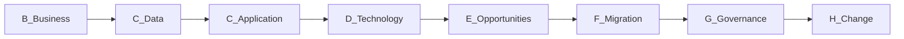
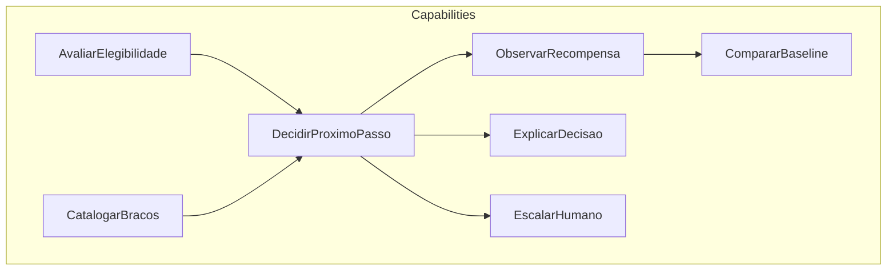
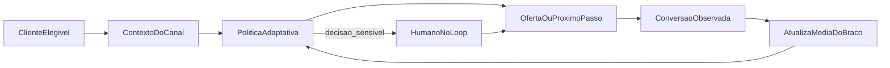
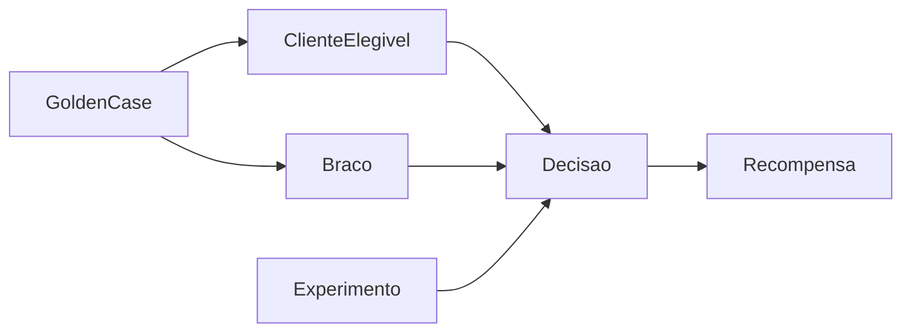
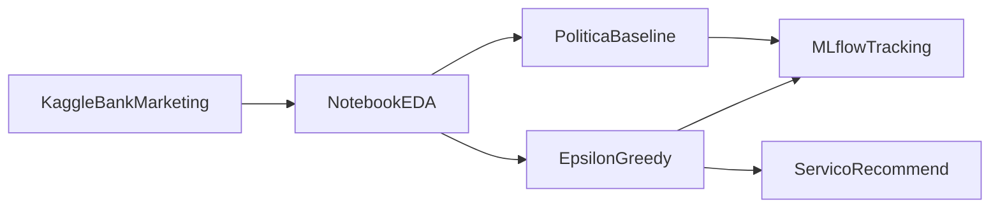
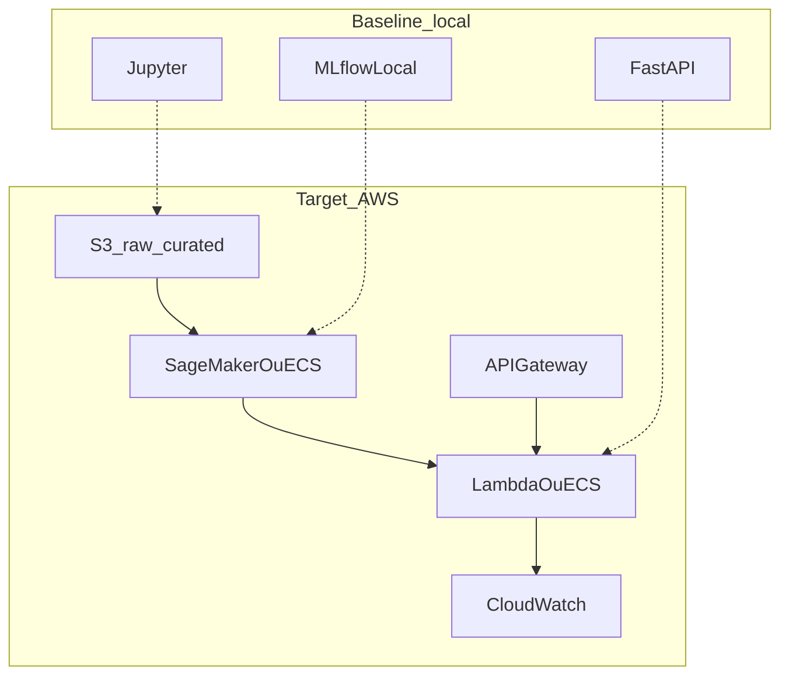
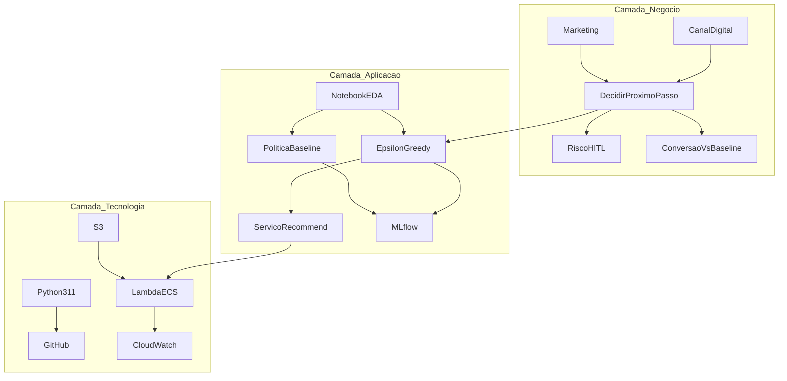

# Datathon 7MLET — experimentação adaptativa de ofertas

Plataforma didática de **Machine Learning Engineering** para decidir, em canal digital, qual oferta, mensagem ou próximo passo apresentar a um cliente elegível. Regras fixas e testes A/B longos desperdiçam tráfego; a política **Epsilon-Greedy** equilibra explotação (usar o que já converte) e exploração (testar o outro braço de propósito).

Este repositório **não reproduz um banco real**. Demonstra o ciclo ponta a ponta pedido no Datathon FIAP Pós Tech MLET (Fase 05): formular o problema, baseline, política adaptativa, avaliação, governança e explicação para negócio e técnica.

**Estado atual:** arquitetura TOGAF (ADM enxuto) consolidada neste README. Código de EDA, Epsilon-Greedy, API e MLflow entra no ciclo seguinte.

| Item | Valor |
|------|--------|
| Política primária | Epsilon-Greedy |
| Baseline | Melhor braço histórico (determinístico) |
| Recompensa | Conversão (`y` = assinatura de depósito a prazo) |
| Dados | [bank-marketing (henriqueyamahata)](https://www.kaggle.com/datasets/henriqueyamahata/bank-marketing) |
| Nuvem-alvo | AWS (texto da Etapa 6 abaixo) |

## Como executar

Ainda não há pipeline executável. Quando o ciclo 2 existir:

```bash
python3 -m venv .venv
source .venv/bin/activate
pip install -r requirements.txt
```

Instruções de notebook, MLflow e `POST /recommend` serão acrescentadas neste mesmo arquivo.

---

## Arquitetura (TOGAF ADM enxuto)

A narrativa **começa na arquitetura de negócio (Fase B)**. Preliminary e A são âncora. Não há pacote solto de governança: este README é o contrato único.



### Preliminary e Fase A — âncora

**Princípios**

1. Só dados públicos Kaggle; nenhum cliente real, identificador, patrimônio, renda, gênero ou raça.
2. Minimização: usar o mínimo de colunas para decidir o braço.
3. Humano no loop para decisão sensível (crédito, recusa, tratamento desigual).
4. Simplicidade do pipeline básico — o PDF pede funcionamento, não um core bancário.
5. Um único artefato de documentação: este README.

**Visão:** dado um cliente elegível e o contexto do canal, a plataforma escolhe um braço (ação de campanha), observa conversão e atualiza a média empírica daquele braço, em vez de congelar a decisão numa regra estática.

**Baseline vs alvo**

| Building block | Baseline (hoje, regra fixa) | Alvo (esta arquitetura) |
|----------------|----------------------------|-------------------------|
| Decisão | Sempre o mesmo produto / melhor histórico congelado | Epsilon-Greedy com `ε` explícito |
| Aprendizado | Nenhum após o go-live | Média do braço atualiza a cada recompensa |
| Evidência | Uma taxa histórica | Conversão acumulada vs baseline + fração exploratória |
| Mudança de política | Novo A/B de semanas | Novo run (catálogo ou `ε`) com rastreio |

---

## Fase B — Arquitetura de negócio

### Motivação

- **Motor:** cada impressão em canal digital custa tráfego; regra fixa não reage a mudança de contexto; A/B clássico trava metade do tráfego numa variante perdedora por muito tempo.
- **Meta:** aumentar **conversão acumulada com exploração controlada**, batendo um baseline determinístico.
- **Restrição:** demonstração acadêmica de maturidade MLE (formular, baseline, avaliar, governar, explicar), não operação de um banco.

### Atores

| Ator | Papel | O que espera da plataforma |
|------|--------|----------------------------|
| Marketing | Dono do catálogo de ofertas/braços | Ganho de conversão visível vs regra fixa |
| Canal digital | Consome a decisão (app, site, contato) | Resposta rápida: qual próximo passo mostrar |
| Risco / compliance | Elegibilidade e HITL | Decisões sensíveis não saem 100% automáticas |
| MLE | Opera o ciclo | Experimento reproduzível, métricas, limites honestos |
| Banca do Datathon | Avalia 30% negócio + 70% técnico | História clara em minutos + pipeline que roda |

### Capabilities

- Catalogar ofertas/braços
- Avaliar elegibilidade
- Decidir o próximo passo (política)
- Observar recompensa (conversão)
- Comparar com baseline
- Explicar a decisão (Golden Set neste README)
- Interromper / escalar a humano



### Value stream



Fluxo em linguagem de negócio: o canal entrega um cliente elegível; a política escolhe um braço (na maior parte do tempo o de melhor média; em `ε`% sorteia outro); se a ação for sensível, um humano confirma; o cliente responde (converte ou não); a média daquele braço é atualizada.

### KPIs de negócio (os 30% da banca)

| KPI | Pergunta que responde |
|-----|------------------------|
| Conversão acumulada vs baseline | A política adaptativa ganhou da regra fixa? |
| Fração de tráfego exploratório | Estamos realmente explorando, ou só explotando? |
| Regret vs melhor braço *a posteriori* | Quanto conversão perdemos por explorar? |
| % de decisões que exigiriam HITL | Onde o automático deve parar? (documentado, não implementado de verdade) |

### Catálogo de braços (decisão de negócio)

A base Kaggle **não é um catálogo de produtos**. Tem target `y` (assinou depósito a prazo?) e canal `contact` (`cellular` / `telephone`). Os **braços são ações de campanha**, não SKUs bancários.

| Braço | Ação de negócio | Origem na base |
|-------|-----------------|----------------|
| `cellular` | Contactar por celular | coluna `contact` |
| `telephone` | Contactar por telefone fixo | coluna `contact` |

Recompensa = `y` (`yes` → 1, `no` → 0). Outras ações (mês, intensidade de `campaign`, “não contactar agora”) ficam no estado-alvo, não no MVP.

### Decisão de política — a mais didática

Critério: a banca precisa entender exploração vs explotação em poucos minutos.

**Epsilon-Greedy (escolhido).** Duas frases: na maior parte do tempo use o braço com melhor conversão média; em `ε`% do tempo sorteie outro, de propósito. Um parâmetro. No Golden Set cada caso marca `explotou` ou `explorou`. Limitação honesta: a exploração é aleatória (pode gastar tráfego num braço já ruim) e `ε` não some sozinho — decay é opcional depois.

**Por que não as outras agora**

| Família | Por que não é o MVP |
|---------|---------------------|
| UCB | Melhor estatisticamente (explora o incerto), mas a demo vira intervalo de confiança. |
| Thompson Sampling | O PDF lista primeiro; priors e posterior atrasam o pitch de 5 min. |
| Contextual | Mais perto de personalização real; menos didático para o pipeline básico. |

Thompson Sampling e contextual entram só como **arquitetura-alvo** (Fases E e H).

---

## Fase C — Arquitetura de dados

### Fonte, versão, licença

| Campo | Valor |
|-------|--------|
| Kaggle | [henriqueyamahata/bank-marketing](https://www.kaggle.com/datasets/henriqueyamahata/bank-marketing) |
| Origem | UCI Bank Marketing, campanhas de telemarketing de um banco português ([Moro et al., 2014](https://archive.ics.uci.edu/dataset/222/bank+marketing)) |
| Recorte | `bank-additional-full.csv` — 41.188 linhas, 20 inputs + `y` |
| Licença | Creative Commons Attribution 4.0 (CC BY 4.0) — citar a fonte |
| Target | `y` — o cliente assinou depósito a prazo? (`yes` / `no`) |

### Colunas e tratamento

Usar como contexto de campanha (sem vazamento): `contact`, `month`, `day_of_week`, `campaign`, `pdays`, `previous`, `poutcome`, indicadores macro (`emp.var.rate`, `cons.price.idx`, `cons.conf.idx`, `euribor3m`, `nr.employed`).

Usar com ressalva (minimização, não perfilamento): `age`, `job`, `marital`, `education`. Não são gênero/raça/renda, mas `job` e `age` são proxies socioeconômicos — não entram como critério automático de recusa.

**Descartar `duration`.** Duração da ligação só existe depois da chamada; se `duration = 0`, em geral `y = no`. É vazamento temporal. O PDF exige o descarte.

Não usar: identificadores reais, patrimônio, renda, gênero, raça — a base pública já não traz esses campos; a regra permanece para qualquer coluna futura.

### Entidades conceituais



| Entidade | O que é |
|----------|---------|
| ClienteElegivel | Features de campanha de uma linha Kaggle, sem `duration` |
| Braco | Ação `cellular` ou `telephone` |
| Decisao | Braço escolhido + flag `explorou` / `explotou` + `ε` |
| Recompensa | Conversão observada (`y`) |
| Experimento | Run futuro no MLflow (params: `ε`, catálogo; métricas: conversão vs baseline) |
| GoldenCase | Um dos 5 perfis de sanidade de negócio |

### Qualidade

- Sem shuffle aleatório que misture tempo de campanha quando o recorte for temporal.
- Sem `duration` em feature, treino ou serving.
- Golden Set: cinco perfis especificados abaixo; recomendações preenchidas só quando a política existir.

### Golden Set (especificação — ainda sem oferta gerada)

Cinco clientes sintéticos no espírito da base, para a Etapa 4. A coluna “oferta” será preenchida pelo modelo no ciclo 2.

| # | Perfil | Por que existe | Oferta | Fez sentido? |
|---|--------|----------------|--------|----------------|
| 1 | Contato celular, campanha prévia com `poutcome=success` | Explotação: histórico positivo | *a preencher* | *a preencher* |
| 2 | Contato telefone, `poutcome=failure` | Exploração ou HITL: já falhou | *a preencher* | *a preencher* |
| 3 | Celular, muitos contatos em `campaign` | Risco de fadiga; HITL documentado | *a preencher* | *a preencher* |
| 4 | Telefone, `previous=0` | Cliente frio; exploração justificada | *a preencher* | *a preencher* |
| 5 | Celular, `pdays=999` (nunca contactado antes) | Sem histórico do braço no indivíduo | *a preencher* | *a preencher* |

---

## Fase C — Arquitetura de aplicação

Building blocks lógicos. Pastas `src/`, notebook e API **ainda não existem**.

| Bloco | Responsabilidade | Etapa do PDF |
|-------|------------------|--------------|
| Notebook EDA | Limpar base, drop `duration`, descrever braços | 1–2 |
| PoliticaBaseline | Sempre o melhor braço histórico (ou sempre o mesmo) | 3 |
| EpsilonGreedy | Com probabilidade `1-ε` o melhor médio; com `ε` sorteia | 3 |
| ServicoRecommend | `POST /recommend` devolve braço + flag explorou/explotou | 5 |
| MLflowTracking | Params (`ε`, braços) e métricas da Etapa 3 | 7 |
| GoldenSet | Cinco casos neste README | 4 |



Contrato-alvo do serviço (não implementado): entrada = features do cliente sem `duration`; saída = `{ "arm": "cellular"|"telephone", "mode": "exploit"|"explore", "epsilon": 0.1 }`.

---

## Fase D — Arquitetura de tecnologia

### Agora (dev / demo local)

Python 3.11, Jupyter, GitHub. No ciclo 2: MLflow local, FastAPI + uvicorn.

### Alvo em nuvem — AWS (Etapa 6)

Para colocar o pipeline no ar, o grupo usaria **S3** como lago da base Kaggle versionada (prefixos `raw/` e `curated/`, sem `duration` na curated). O treino offline da política (contagem por braço, conversão, comparação com baseline) rodaria num job **SageMaker Processing** ou num container em **ECS**. O serviço `POST /recommend` ficaria atrás de **API Gateway** + **Lambda** (ou um serviço ECS se a demo precisar de processo longo). **CloudWatch** guardaria logs, latência e a fração de respostas `explore` vs `exploit`. O tracking de experimento, que no notebook é MLflow local, no alvo publicaria métricas no próprio MLflow self-hosted ou em parâmetros de um experimento SageMaker. Nenhum dado de cliente real entra nesses buckets.



---

## Fases E e F — Oportunidades e migração

O que o PDF pede, em que ciclo entra, e qual fase ADM cobre.

| Etapa PDF | Conteúdo | Ciclo | Fase ADM |
|-----------|----------|-------|----------|
| 0 | Repo público, README, `requirements.txt` | **este** | Preliminary / G |
| 1–2 | Link Kaggle, EDA, features + target | 2 | C dados |
| 3 | Baseline vs Epsilon-Greedy, adaptativo ganhando | 2 | B + C aplicação |
| 4 | Métricas + Golden Set preenchido | 2 | G |
| 5 | Script, notebook ou FastAPI `/recommend` | 2 | C aplicação + D |
| 6 | Parágrafo + diagrama AWS | **este** | D |
| 7 | MLflow com params e métricas da Etapa 3 | 2 | G |
| 8 | Vídeo ≤ 5 min | 3 | A (comunicação da visão) |

**Oportunidade adiada (não MVP):** Thompson Sampling, política contextual, decay de `ε`, mais braços que canal de contato.


---

## Fases G e H — Governança e mudança

### G — Implementation governance

- Este README é o contrato. Sem `docs/` de governança paralela.
- Golden Set = teste de sanidade de negócio (cinco linhas acima).
- HITL: perfis 2 e 3 da tabela são os que a arquitetura marca como “humano deveria olhar”; o MVP acadêmico só documenta, não abre fila de aprovação.
- Base legal / finalidade / retenção (Kaggle, não cliente real): finalidade = demonstração de política adaptativa; minimização = drop `duration` e sem atributos proibidos; retenção = artefatos de experimento no Git/MLflow do grupo, sem republicar a base.
- MLflow (quando existir) é a evidência de que `ε`, catálogo e métricas vs baseline foram registrados.

### H — Architecture change management

O bandit **é** o mecanismo de mudança: cada recompensa atualiza a média empírica do braço; `ε` permanece explícito e auditável. Troca de catálogo de braços ou de valor de `ε` vira **novo run**, não um hotfix silencioso. Política contextual (features do cliente na escolha) só entra quando o MVP Epsilon-Greedy já tiver batido o baseline no notebook.

### Requirements management

Requisito raiz (PDF): política adaptativa superando baseline, com exploração visível, dados Kaggle, serving demonstrável e README único. Qualquer feature que não sirva a isso (portfólio, LSTM, dados reais) está fora.

---

## Diagrama-mestre — camadas TOGAF



---

## Limitações honestas

- Epsilon-Greedy explora de forma aleatória; não privilegia o braço incerto.
- Dois braços de canal são um proxy de “oferta”, não um catálogo comercial.
- Conversão na base é assinatura de depósito após contato telefônico — não é clique em app.
- Sem dados reais; generalizar para um banco brasileiro exigiria nova base legal e HITL operacional.
- Arquitetura-alvo AWS não está provisionada; é o mapa da Etapa 6.
